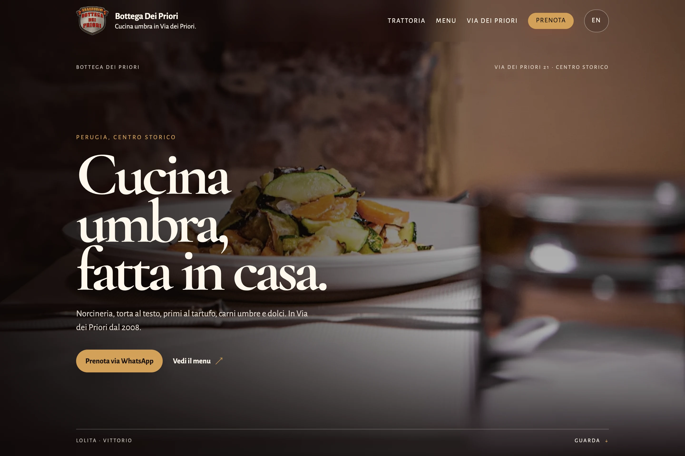
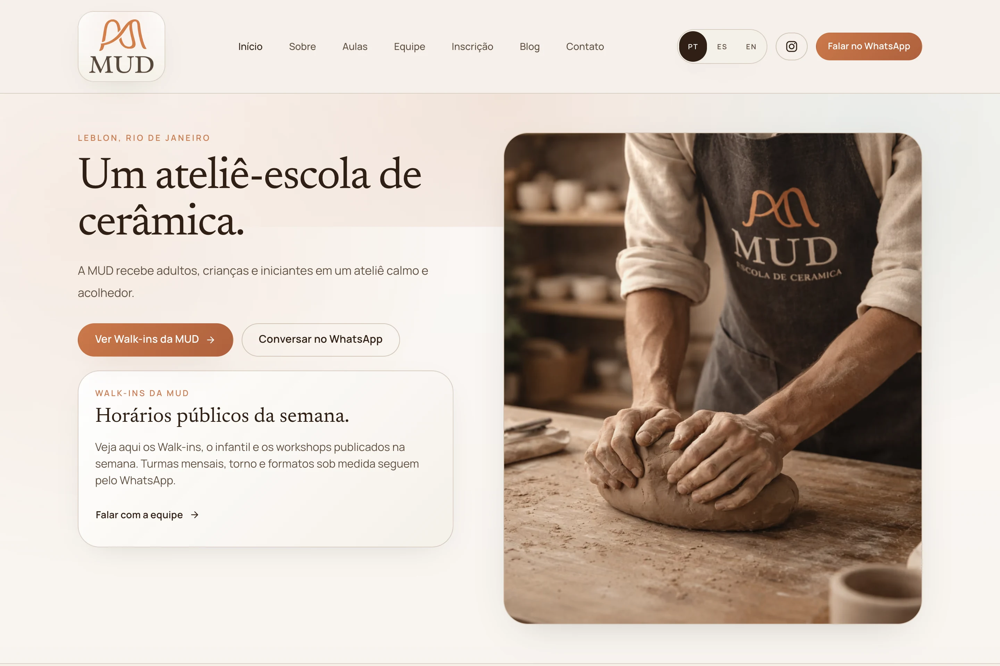
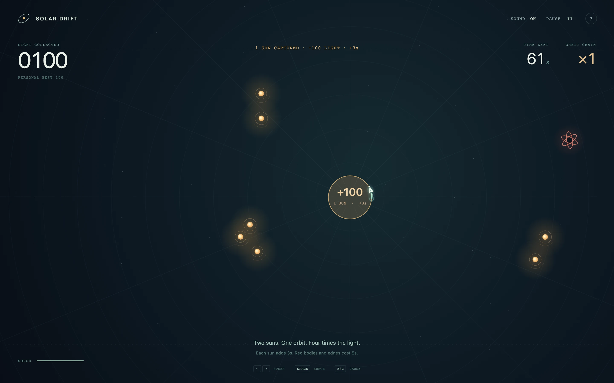

# Hello, I'm Mario.

**Usually Fortune online.**

I build websites and useful tools — for local businesses, difficult research questions, and people working with AI. I like making the complicated part easier to use.

[Website](https://fortunexbt.com) &nbsp; / &nbsp; [MUTX](https://github.com/mutx-dev/mutx-dev) &nbsp; / &nbsp; [Say hello](https://t.me/fortunexbt)

 

## Work, up close

**[MUTX](https://github.com/mutx-dev/mutx-dev)** · Tools around AI agents. I work on the API, dashboard, CLI and SDK so people can see what their agents are doing, set limits and step in. A human approval becomes a saved record, with a life beyond the chat. [Docs ↗](https://docs.mutx.dev/) · [Upstream credits ↗](https://github.com/mutx-dev/mutx-dev/blob/main/CREDITS.md)

**[Tablebeam](https://github.com/fortunexbt/tablebeam)** · Questions about a spreadsheet, with the source rows beside the answer. A separate search chooses the rows; a local model writes the response. Exact totals and joins stay with a dataframe or SQL.

<table>
  <tr>
    <td width="50%" valign="top">
      
      <h3><a href="https://www.bottegapriori.com/">Bottega Dei Priori ↗</a></h3>
      
Bilingual menus and direct booking conversations.

    </td>
    <td width="50%" valign="top">
      
      <h3><a href="https://mudescoladeceramica.com/pt">MUD ↗</a></h3>
      
A ceramics studio and its weekly class finder.

    </td>
  </tr>
</table>

Both websites are shared work with Walberth Soares through <a href="https://civicodue.eu/">Civico Due</a>. Images show the real public websites.

## A game for your next break

**[Solar Drift](https://github.com/fortunexbt/solar-drift/tree/fortune/orbital-lasso)** · I'm rebuilding it around one rule: circle the suns, then cross your own wake to collect them. Wide orbits can catch more light; red bodies make the route interesting. Keyboard, pointer and touch, with sound made in the browser.

The orbital redesign is on its review branch. <a href="https://fortunexbt.github.io/solar-drift/">The published game</a> currently runs the earlier version.

More small experiments: [Terminal Starfield](https://github.com/fortunexbt/terminal-starfield) · [ckitty](https://github.com/fortunexbt/ckitty) · [Loop Courier](https://github.com/fortunexbt/loop-courier).

## Behind the work

I studied politics and international relations at Cardiff University and have worked in crypto research and governance. That interest in how people make decisions runs through the software I build.

I use AI throughout development. I choose what to build, check the output, integrate the pieces and review the result. The decisions and delivery are my responsibility.

Usually Python and TypeScript, often React / Next.js, FastAPI, SQL and Docker. Small terminal projects give me a reason to write C. The task decides the tools.

[BoundaryBench](https://github.com/fortunexbt/boundary-bench) explores how AI agents handle boundaries and permitted work. The [Field Manual](https://github.com/fortunexbt/docs) has longer project notes. You can also follow my submitted contributions to [Hermes Agent](https://github.com/NousResearch/hermes-agent/pull/65575) and [Open Design](https://github.com/nexu-io/open-design/pull/6427).

---

Tell me about the business, the idea, or the thing you're tired of doing by hand.

[Work & contact](https://fortunexbt.com) &nbsp; / &nbsp; [Telegram](https://t.me/fortunexbt) &nbsp; / &nbsp; [X](https://x.com/fortunexbt) &nbsp; / &nbsp; [Writing](https://fortunexbt.substack.com/)
