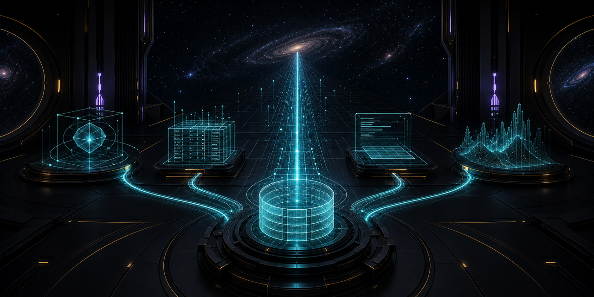

  
  <h1>Mario / Fortune</h1>
  
<strong>Control planes for machines. Tiny worlds for humans. Every system shows its work.</strong>

  

    <a href="https://mutx.dev">RUN MUTX</a>
    &nbsp;&middot;&nbsp;
    <a href="https://github.com/fortunexbt/terminal-starfield">PLAY STARFIELD</a>
    &nbsp;&middot;&nbsp;
    <a href="https://github.com/fortunexbt/tablebeam">ASK TABLEBEAM</a>
    &nbsp;&middot;&nbsp;
    <a href="https://github.com/fortunexbt/ckitty">SUMMON CKITTY</a>
  

I build systems that have to survive contact with reality: bounded AI agents, local-first tools, inspectable market infrastructure, and deterministic terminal experiments.

The common thread is simple. A useful system should make its state visible, preserve a trail, and let a human understand what happened after the demo ends.

## Now shipping: [MUTX](https://github.com/mutx-dev/mutx-dev)

**The control plane around the agent.** MUTX gives operators one surface for identity, runs, permissions, budgets, approvals, observability, and audit history.

`5 releases` &nbsp; `signed macOS app` &nbsp; `API + SDK + CLI + TUI` &nbsp; `auditable runs`

**[Try it](https://mutx.dev)** · **[Read the code](https://github.com/mutx-dev/mutx-dev)** · **[Open the docs](https://docs.mutx.dev)** · **[Download for macOS](https://mutx.dev/download/macos)**

## Choose a system

<table>
  <tr>
    <td width="50%" valign="top">
      
      <h3>Terminal Starfield</h3>
      
A zero-dependency deep-space combat roguelite with seeded runs, machine-readable state, exact-width rendering, and a tested 15-wave campaign.

      
<code>PYTHON</code> <code>DETERMINISTIC</code> <code>RELEASED</code>

      
<a href="https://github.com/fortunexbt/terminal-starfield"><strong>PLAY / CODE / PROOF</strong></a>

    </td>
    <td width="50%" valign="top">
      
      <h3>ckitty</h3>
      
A tiny native terminal cat in C11 and ncurses. Procedural poses, deterministic frames, resize-safe animation, sanitizers, and no runtime baggage.

      
<code>C11</code> <code>NATIVE</code> <code>SEEDED</code>

      
<a href="https://github.com/fortunexbt/ckitty"><strong>INSTALL / CODE / PROOF</strong></a>

    </td>
  </tr>
  <tr>
    <td width="50%" valign="top">
      
      <h3>Tablebeam</h3>
      
Private-by-default Q&amp;A for CSV and Google Sheets. It runs against local models and points every answer back to the source rows.

      
<code>LOCAL AI</code> <code>TRACEABLE</code> <code>DOCKER</code>

      
<a href="https://github.com/fortunexbt/tablebeam"><strong>RUN / CODE / PROOF</strong></a>

    </td>
    <td width="50%" valign="top">
      
      <h3>Fortune Field Manual</h3>
      
Architecture tours, demo recipes, tradeoffs, and build receipts for the systems in this workshop. The depth layer behind the demos.

      
<code>ARCHITECTURE</code> <code>DECISIONS</code> <code>FIELD NOTES</code>

      
<a href="https://github.com/fortunexbt/docs"><strong>OPEN THE MANUAL</strong></a>

    </td>
  </tr>
</table>

## Four operating principles

| Principle | What it means here | Proof in the workshop |
|---|---|---|
| **Bounded** | Authority, budgets, and approvals are explicit. | MUTX policy and run controls |
| **Local** | Your data can stay on your machine. | Tablebeam and private research workbenches |
| **Deterministic** | Important state can be replayed and tested. | Starfield seeds, ckitty frames, fixture-driven tools |
| **Verifiable** | Claims have receipts, sources, or an audit trail. | MUTX events, cited table rows, release checks |

## Selected private systems

I also build local RNA review tooling, cross-border settlement and governance infrastructure, autonomous market-research agents, and multilingual client products. The repositories stay private; the architecture, boundaries, and lessons surface in the [Field Manual](https://github.com/fortunexbt/docs).

## Working set

**Languages** — Python, TypeScript, Solidity, C, SQL, Bash 
**Product** — FastAPI, React, Next.js, PostgreSQL, Redis, Docker 
**Infrastructure** — Terraform, Ansible, Helm, CI/CD, observability 
**Human languages** — English, Italian, Spanish, Portuguese; basic German

If you are building agent infrastructure, local-first AI, or economically serious onchain systems, [talk to me](mailto:mario@mutx.dev).

  <a href="https://mutx.dev">mutx.dev</a>
  &nbsp;&middot;&nbsp;
  <a href="https://x.com/FortuneXBT">X</a>
  &nbsp;&middot;&nbsp;
  <a href="https://t.me/fortunexbt">Telegram</a>
  &nbsp;&middot;&nbsp;
  <a href="mailto:mario@mutx.dev">Email</a>

